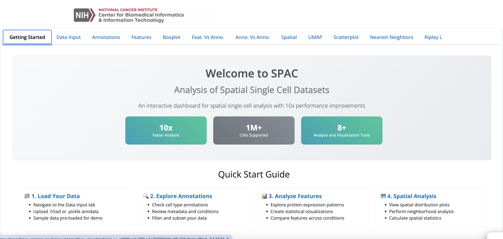

# SPAC Interactive Visualization

**Real-time dashboard for spatial single-cell data exploration**

An interactive Shiny for Python dashboard that transforms complex spatial
single-cell datasets into dynamic, explorable visualizations. Just upload your
analyzed data and start discovering biological insights through intuitive point-and-click analysis.

## Why Use This Dashboard?

Spatial single-cell datasets are complex and difficult to explore. This interactive dashboard solves that by providing:

- **Live exploration** - Click, filter, and zoom through your spatial data in real-time
- **No coding required** - Intuitive interface for biologists
- **Multiple view types** - Spatial maps, dimensionality reduction plots, heatmaps, and statistics
- **Hypothesis testing** - Quickly subset data and compare cell populations interactively



## Interactive Features

### �️ **Spatial Visualization**
- **Interactive tissue maps** - Color cells by any feature, zoom into regions of interest
- **Real-time filtering** - Subset cells based on expression, location, or annotations
- **Customizable styling** - Adjust colors, point sizes, and transparency on-the-fly

### 📊 **Statistical Exploration**
- **Dynamic plots** - UMAP, t-SNE, heatmaps, boxplots that update as you filter data
- **Comparative analysis** - Side-by-side visualization of different conditions or cell types
- **Export ready figures** - Generate and download publication-quality plots directly from the interface

## Quick Start

### 🚀 Try the Live Demo
**No installation needed!** Explore SPAC with sample data:

👉 **[Launch Interactive Demo](https://appshare.cancer.gov/spac-interactive-visualization/)**

### 💻 Run Locally with Docker
```bash
git clone https://github.com/FNLCR-DMAP/SPAC_Shiny.git
cd SPAC_Shiny
make run
```

Open your browser to `http://localhost:8001` to start exploring!

#### Other Useful Commands
```bash
make help      # Show all available commands
make logs      # View application logs
make stop      # Stop the container
make clean     # Remove container and image
```

### Load Your Data
Supports common spatial single-cell formats:
- **AnnData (.h5ad or pickle files)** - Standard format with spatial coordinates and features

## What You Can Explore

Perfect for analyzing:
- **Multiplex imaging data** (IMC, MIBI, MxIF, CyCIF, CODEX)
- **Spatial transcriptomics** (Visium, Xenium, MERFISH)
- **Tumor microenvironments** and tissue architecture
- **Cell-cell interactions** and spatial patterns

## Documentation & Support

- **[Getting Started Guide](getting_started.md)** - Step-by-step usage instructions
- **[Technical Details](TECHNICAL_DETAILS.md)** - Full project documentation and benchmarks
- **[Contributing Guide](CONTRIBUTING.md)** - Information for contribution
- **Issues**: [GitHub Issues](https://github.com/FNLCR-DMAP/SPAC_Shiny/issues)
- **Contact**: george.zaki@nih.gov

## Citation

```
Liu, F., He, R., Sheeley, T., et al. SPAC: A Scalable and Integrated Enterprise
Platform for Single-Cell Spatial Analysis. [under review] (2025)
```

---

Developed by Frederick National Laboratory for Cancer Research and Purdue Data
Mine
